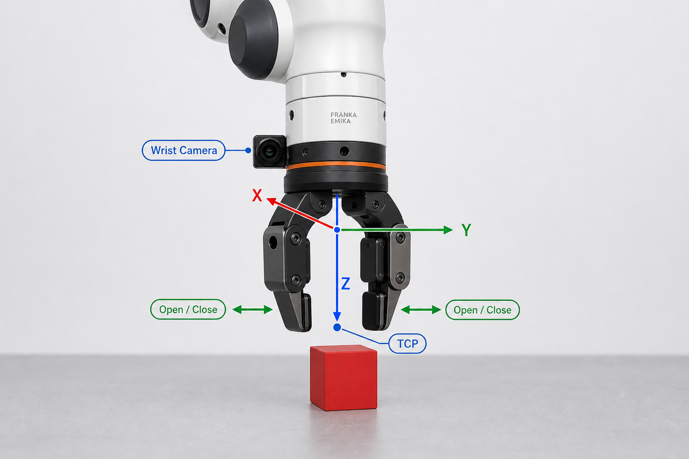

# Franka Panda 夹爪坐标系对照讲解

> 下面的实物风格图用于帮助理解 `panda_hand`、TCP、抓取方向和夹爪开合方向。  
> 图中的方向是教学表达；实际运行时，应以 Isaac Sim 中 `/World/Franka/panda_hand` 的局部坐标轴为准。



## 1. 图中的关键位置

| 图中标记 | 在当前 Demo 中的对应对象 |
| --- | --- |
| 手掌中央的坐标原点 | `/World/Franka/panda_hand` |
| TCP | 两根手指之间、实际希望对准物体的位置 |
| Wrist Camera | `/World/Franka/panda_hand/wrist_camera` |
| 红色 X、绿色 Y、蓝色 Z | `panda_hand` 的局部坐标轴 |

当前代码把 `panda_hand` 注册为末端执行器：

```python
end_effector_prim_path=f"{FRANKA_PRIM_PATH}/panda_hand"
```

所以 RMPFlow 控制的目标位置和姿态，默认是 `panda_hand` 原点的目标，而不是图中 TCP 点的目标。

## 2. 蓝色 Z：接近和抓取方向

图中蓝色 Z 轴从手掌朝方块方向延伸。

执行顶部抓取时，希望这个方向朝向世界坐标系的下方：

```text
panda_hand local Z 约等于 world -Z
```

当前代码使用：

```python
EE_TARGET_ORIENTATION = euler_angles_to_quat(
    np.array([0.0, np.pi, 0.0], dtype=np.float32)
)
```

它让末端相对于默认方向绕 Y 轴翻转 `180°`，目的就是让夹爪朝向桌面。

因此抓取过程中：

```text
target_position 的 Z 逐渐减小
    -> panda_hand 沿世界坐标向下移动
    -> TCP 接近 cube
```

## 3. 绿色 Y：夹爪开合方向

图中两根手指沿水平方向分开或靠拢。

当前 Demo 使用两个手指关节控制开合：

```python
joint_prim_names=[
    "panda_finger_joint1",
    "panda_finger_joint2",
]
```

夹爪打开：

```python
joint_opened_positions=np.array([0.05, 0.05], dtype=np.float32)
```

夹爪关闭：

```python
joint_closed_positions=np.array([0.01, 0.01], dtype=np.float32)
```

两个手指分别向相反方向运动，因此夹爪总开口宽度可近似计算为：

```python
gripper_width = joint_positions[7] + joint_positions[8]
```

注意：手指真实的局部关节运动轴由 USD 模型定义。图中把它概念性地表示为 Y 方向，方便理解“开合轴”。

## 4. 红色 X：夹爪横向姿态

X 轴与 Y、Z 一起组成右手坐标系：

```text
X × Y = Z
```

抓取正方体时，绕 Z 轴旋转夹爪会改变手指从哪个方向夹住物体。例如：

```text
手指沿世界 Y 方向开合
    -> 从方块左右两侧夹取

手指沿世界 X 方向开合
    -> 从方块前后两侧夹取
```

这就是末端姿态不仅要“朝下”，还需要控制绕竖直方向旋转角度的原因。

## 5. `panda_hand` 原点与 TCP 的偏移

图中可以看到：

```text
panda_hand 原点
        |
        | 固定偏移
        ↓
       TCP
```

当前控制器使用 `panda_hand` 作为末端执行器。如果直接把方块中心位置作为：

```python
target_end_effector_position=cube_position
```

那么控制器会尝试让手掌原点到达方块中心，可能造成夹爪过低或碰撞。

实际抓取目标通常需要加入偏移：

```python
panda_hand_target = desired_tcp_position - tcp_offset_in_world
```

当前 Demo 通过预抓取高度、悬停高度和下降过程间接处理这个问题，例如：

```python
pre_grasp_position = pick_position + np.array([0.0, 0.0, 0.025])
```

## 6. 手腕相机坐标系

手腕相机是 `panda_hand` 的子节点：

```python
WRIST_CAMERA_PATH = f"{FRANKA_PRIM_PATH}/panda_hand/wrist_camera"
```

相机相对手掌的安装参数为：

```python
position=(0.06, 0.0, 0.03)
rotation_xyz_deg=(-95.0, 0.0, -90.0)
```

含义是：

- 相机会跟随夹爪一起运动；
- 相机原点相对 `panda_hand` 有位置偏移；
- 相机还有自己的局部旋转，所以相机光轴不等于 `panda_hand` 的 Z 轴。

## 7. 如何确认仿真中的真实轴方向

读取当前 `panda_hand` 世界姿态，并把局部轴转换到世界坐标系：

```python
from isaacsim.core.utils.rotations import quat_to_rot_matrix

position, orientation = franka.end_effector.get_world_pose()
rotation = quat_to_rot_matrix(orientation)

print("panda_hand origin:", position)
print("local X in world:", rotation[:, 0])
print("local Y in world:", rotation[:, 1])
print("local Z in world:", rotation[:, 2])
```

顶部向下抓取时，期望某个工具接近轴接近世界向下方向：

```text
[0, 0, -1]
```

如果实际打印结果不是 local Z 接近 `[0, 0, -1]`，说明该 USD 资产使用了不同的工具轴约定。此时应以打印结果和 Isaac Sim 界面中显示的局部坐标轴为准，而不是强行套用示意图。
