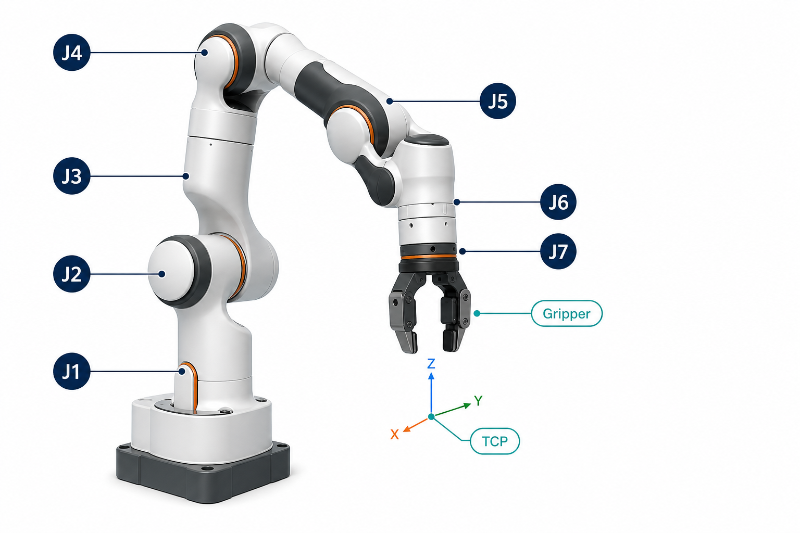

# Franka Panda 机械臂入门



Franka Panda 是一款常见的协作机械臂。它经常用于机器人教学、抓取实验、视觉操作、模仿学习和具身智能研究。在本项目中，Demo `05-08` 使用的就是 Franka Panda。

## 1. 先认识机械臂的组成

一套常见的 Franka Panda 仿真模型可以拆成：

| 部分 | 作用 |
| --- | --- |
| Base | 固定机械臂底座 |
| J1-J7 | 机械臂本体的 7 个旋转关节 |
| Links | 连接相邻关节的刚性连杆 |
| Flange / Wrist | 腕部末端连接区域 |
| Gripper | 两指夹爪，用于抓取物体 |
| TCP | Tool Center Point，工具中心点，也叫末端执行器参考点 |

末端执行器不一定只能是夹爪。真实机器人也可以安装吸盘、相机、焊枪或其他工具。安装工具后，控制器通常关注的是 TCP 的位置和姿态。

## 2. 自由度是什么

自由度（Degree of Freedom，DoF）表示一个机械系统可以独立运动的方向数量。

空间中的刚体最多有 6 个常见运动自由度：

| 类型 | 含义 |
| --- | --- |
| X、Y、Z | 沿三个方向平移 |
| Roll | 绕 X 轴旋转 |
| Pitch | 绕 Y 轴旋转 |
| Yaw | 绕 Z 轴旋转 |

Franka Panda 的机械臂本体有 **7 个旋转自由度**，因此常被称为 `7-DoF` 机械臂。

为什么操作末端位姿只需要 6 个自由度，但机械臂有 7 个关节？

因为多出的 1 个自由度带来了冗余。末端保持在同一个位置和姿态时，机械臂的肘部仍然可以改变姿势。这有助于：

- 绕开障碍物
- 避免碰撞桌面
- 远离关节极限
- 选择更自然的姿态

## 3. J1-J7 分别做什么

从底座到腕部，Franka Panda 有 7 个旋转关节：

| 关节 | 大致位置 | 直观作用 |
| --- | --- | --- |
| J1 | 底座附近 | 控制机械臂整体左右转向 |
| J2 | 下部肩关节 | 控制手臂向前、向后俯仰 |
| J3 | 上臂区域 | 调整肘部方向和侧向姿态 |
| J4 | 中部肘关节 | 主要负责弯曲和伸展 |
| J5 | 前臂区域 | 调整腕部朝向 |
| J6 | 腕部 | 控制末端俯仰 |
| J7 | 靠近法兰 | 控制末端绕自身轴线旋转 |

这是帮助入门的直观理解。严格来说，末端位姿通常是多个关节共同作用的结果，并不是一个关节只负责一个方向。

## 4. 为什么仿真代码里常出现 9 个关节值

Franka Panda 机械臂本体是 `7-DoF`，但 Isaac Sim 的常见 Panda 模型还包含夹爪的两个可动指关节：

```text
arm joints:     J1 J2 J3 J4 J5 J6 J7
finger joints:  left_finger right_finger
total values:   7 + 2 = 9
```

本项目中的初始姿态示例：

```python
joint_positions = [
    0.0, -0.8, 0.0, -2.0, 0.0, 2.2, 0.8,  # J1-J7
    0.04, 0.04,                               # left/right finger
]
```

夹爪的两个值表示两根手指的位置。通常：

- `0.04, 0.04`：夹爪张开
- `0.00, 0.00`：夹爪闭合

所以，不要把 `9` 个控制值误解为机械臂本体有 `9-DoF`。

## 5. 关节空间与笛卡尔空间

控制机械臂时，最常见的两种思路是关节空间控制和笛卡尔空间控制。

### 5.1 关节空间控制

直接给 J1-J7 指定目标角度。

```python
robot.apply_action(
    ArticulationAction(
        joint_positions=[0.0, -0.8, 0.0, -2.0, 0.0, 2.2, 0.8, 0.04, 0.04]
    )
)
```

优点：

- 容易理解
- 适合学习关节和检查机器人是否能正常运动
- 适合播放已有轨迹

不足：

- 不容易直接表达“把夹爪移动到 cube 上方”
- 手动调关节角比较费时间

### 5.2 笛卡尔空间控制

直接描述 TCP 的目标位置和姿态：

```text
target_position = [x, y, z]
target_orientation = [qx, qy, qz, qw]
```

控制器再使用逆运动学（Inverse Kinematics，IK）求出对应的 J1-J7。

优点：

- 更符合抓取任务的思考方式
- 容易表达“向下移动 5 cm”或“移动到物体上方”

不足：

- 同一个末端目标可能对应多组关节角
- 可能遇到不可达位置、奇异位形或关节极限

## 6. 正运动学、逆运动学和雅可比矩阵

### 6.1 正运动学 FK

已知关节角，计算 TCP 在哪里：

```text
q = [q1, q2, ..., q7]
TCP_pose = FK(q)
```

用途：

- 显示末端位置
- 判断机械臂是否到达目标
- 记录示范轨迹

### 6.2 逆运动学 IK

已知 TCP 想到哪里，求关节角：

```text
target_TCP_pose -> IK -> q_target
```

用途：

- 抓取 cube
- 末端跟踪轨迹
- 把 VLA 输出的末端动作转换成机器人动作

### 6.3 雅可比矩阵 Jacobian

雅可比矩阵描述关节速度和末端速度之间的局部关系：

```text
TCP_velocity = Jacobian(q) * joint_velocity
```

它常用于 differential IK，也就是根据末端的小幅移动增量不断更新关节目标。

## 7. 常见控制层级

可以把控制方式理解成从底层到高层的阶梯：

| 控制方式 | 输入 | 特点 |
| --- | --- | --- |
| 力矩控制 | `joint_efforts` | 最底层，灵活但难调 |
| 速度控制 | `joint_velocities` | 控制关节转动速度 |
| 位置控制 | `joint_positions` | 最容易入门，常用于轨迹播放 |
| IK 控制 | TCP 目标位姿 | 适合抓取和末端轨迹 |
| Differential IK | TCP 位姿增量 | 适合连续闭环控制 |
| Motion Planning | 起点、终点和环境 | 自动考虑轨迹、约束和避障 |
| VLA Policy | 图像、文字指令、机器人状态 | 模型预测动作，再交给底层控制器执行 |

VLA 并不是机械臂电机控制器。它通常位于较高层：

```text
camera image + language instruction + robot state
  -> VLA policy
  -> end-effector delta or action chunk
  -> IK / controller
  -> joint targets
  -> Franka
```

## 8. 一个抓取 cube 的典型流程

抓取任务一般不是一次命令，而是一系列阶段：

```text
1. OPEN_GRIPPER   张开夹爪
2. MOVE_ABOVE     移动到 cube 上方
3. LOWER          缓慢下降
4. CLOSE_GRIPPER  闭合夹爪
5. LIFT           抬起物体
6. MOVE_TO_DROP   移动到目标区域
7. OPEN_GRIPPER   放下物体
```

本项目中可以按顺序学习：

| Demo | 学习内容 |
| --- | --- |
| `05_franka_joint_control` | 加载 Franka，发送关节位置 |
| `06_franka_gripper_sequence` | 单独控制夹爪，执行动作序列 |
| `07_franka_pick_cube` | 用脚本抓取 cube |
| `08_pick_place_state_machine` | 用状态机表达抓取和放置流程 |
| `10_ros2_franka_control` | 通过 ROS 2 发送关节命令 |
| `14_groot_pick_place` | 把 VLA 输出接入控制回路 |

## 9. 初学时需要注意什么

1. 先在安全姿态附近做小幅运动，不要一开始就发送大角度跳变。
2. 位置控制目标要考虑关节极限。
3. TCP 目标必须在机械臂可达空间内。
4. 抓取时要注意 cube、桌面、夹爪和连杆之间的碰撞。
5. 仿真中的夹爪闭合不等于一定抓稳，要检查接触、摩擦和物体是否被抬起。
6. VLA 输出必须经过动作语义适配，不同模型的数据集动作定义并不相同。

## 10. 建议的学习顺序

建议先完成：

```text
05 -> 06 -> 07 -> 08 -> 10 -> 11 -> 12 -> 14
```

掌握这些之后，再继续 OpenVLA 或 GR00T 接入会顺畅很多。
