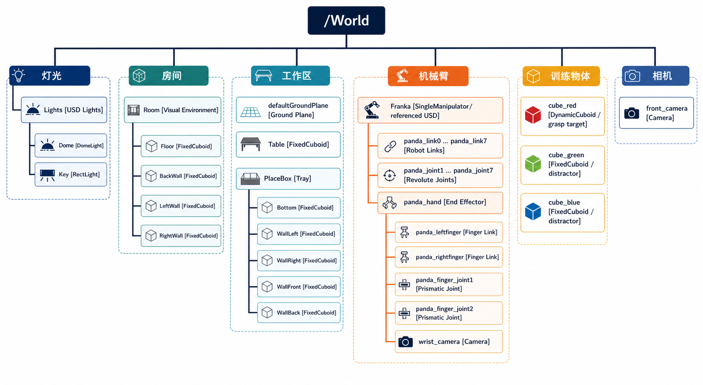

# Franka SmolVLA 数据采集场景树

下图根据 `17_franka_smolvla_data_collection/demo.py` 当前场景构建代码生成。



## 场景的 USD Stage 层级

```text
/World
├── Lights
│   ├── Dome                         [DomeLight]
│   └── Key                          [RectLight]
├── Room
│   ├── Floor                        [FixedCuboid]
│   ├── BackWall                     [FixedCuboid]
│   ├── LeftWall                     [FixedCuboid]
│   └── RightWall                    [FixedCuboid]
├── defaultGroundPlane               [Ground Plane]
├── Table                            [FixedCuboid]
├── PlaceBox
│   ├── Bottom                       [FixedCuboid]
│   ├── WallLeft                     [FixedCuboid]
│   ├── WallRight                    [FixedCuboid]
│   ├── WallFront                    [FixedCuboid]
│   └── WallBack                     [FixedCuboid]
├── Franka                           [SingleManipulator / referenced USD]
│   ├── panda_link0 ... panda_link7  [Robot Links]
│   ├── panda_joint1 ... panda_joint7[Revolute Joints]
│   └── panda_hand                   [End Effector]
│       ├── panda_leftfinger         [Finger Link]
│       ├── panda_rightfinger        [Finger Link]
│       ├── panda_finger_joint1      [Prismatic Joint]
│       ├── panda_finger_joint2      [Prismatic Joint]
│       └── wrist_camera             [Camera]
├── cube_red                         [DynamicCuboid / grasp target]
├── cube_green                       [FixedCuboid / distractor]
├── cube_blue                        [FixedCuboid / distractor]
└── front_camera                     [Camera]
```

## `/World` 是什么

`/World` 是当前 USD Stage 中场景对象的共同根节点。代码中创建物体时使用的 `prim_path` 决定了它在树中的位置：

```python
prim_path="/World/Table"
prim_path="/World/Room/Floor"
prim_path="/World/PlaceBox/Bottom"
```

路径中的 `/` 表示父子关系：

```text
/World/PlaceBox/Bottom

World
└── PlaceBox
    └── Bottom
```

## Room：视觉房间

`add_room(world)` 创建四个固定长方体：

```text
Room
├── Floor
├── BackWall
├── LeftWall
└── RightWall
```

这些对象主要用于提供视觉背景。它们是 `FixedCuboid`，不会因重力移动。

## 工作区：桌面和托盘

桌子是一个单独的固定物体：

```text
/World/Table
```

托盘由五个 `FixedCuboid` 拼成：

```text
PlaceBox
├── Bottom
├── WallLeft
├── WallRight
├── WallFront
└── WallBack
```

使用多个简单碰撞体拼装托盘，比导入复杂模型更容易判断方块是否进入托盘。

## Franka：引用资产与控制封装

代码首先把 Franka USD 资产引用到：

```python
add_reference_to_stage(
    usd_path=franka_usd,
    prim_path="/World/Franka",
)
```

随后用 `SingleManipulator` 封装同一个 Prim：

```python
SingleManipulator(
    prim_path="/World/Franka",
    end_effector_prim_path="/World/Franka/panda_hand",
    gripper=gripper,
)
```

因此：

- `/World/Franka` 是 USD Stage 中的机器人 Prim；
- `SingleManipulator` 是 Python 中用于控制这个 Prim 的对象；
- 它们不是两个不同的机器人。

Franka 内部包括：

- `panda_link0 ... panda_link7`：具有质量、外观和碰撞体的连杆；
- `panda_joint1 ... panda_joint7`：连接连杆的旋转关节；
- `panda_hand`：当前代码使用的末端执行器；
- 两根手指实体和两个移动关节；
- 挂载在 `panda_hand` 下的手腕相机。

## 训练物体

三个方块直接位于 `/World` 下：

```text
cube_red    DynamicCuboid
cube_green  FixedCuboid
cube_blue   FixedCuboid
```

红色方块是抓取目标，因此是动态刚体。绿色和蓝色方块只作为视觉干扰物，因此是固定物体。

## 两路相机为什么位置不同

前视相机：

```text
/World/front_camera
```

它直接位于 `/World` 下，因此不会跟随机械臂运动。

手腕相机：

```text
/World/Franka/panda_hand/wrist_camera
```

它是 `panda_hand` 的子节点，因此会继承手掌的变换，随着夹爪一起运动。

## USD 层级与 Python 对象关系不是同一回事

图中主要表达 USD Stage 层级。Python 中还有另一套对象关系：

```text
World Python Object
├── world.scene
│   ├── FixedCuboid objects
│   ├── DynamicCuboid objects
│   └── SingleManipulator franka
├── front_camera Camera wrapper
└── wrist_camera Camera wrapper
```

例如 `Camera(...)` 是读取图像的 Python 传感器接口，它包装已经存在于 USD Stage 中的 Camera Prim，并不会额外创建第二台相机。

## 关于 Franka 内部层级的说明

图片将 links、joints 和 fingers 按教学逻辑归类到 Franka 下。真实 Franka USD 文件中的 Prim 嵌套位置可能比图中更复杂，关节 Prim 也不一定直接位于 `panda_hand` 下。

判断真实层级时，应以 Isaac Sim Stage 面板显示的 Prim 树为准。
